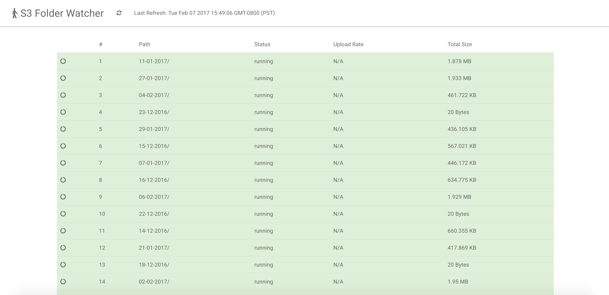

# s3-folder-watcher
Watch the file size of s3 folders during large uploads

### Setup
1. create an empty dynamodb table to store stats
2. Update the settings.json in the application directory
3. Install dependencies
  ```bash
  npm install
  ```
4. Start the application
  ```bash
  node server.js
  ```
5. Open the browser to watch progress http://localhost:3000



